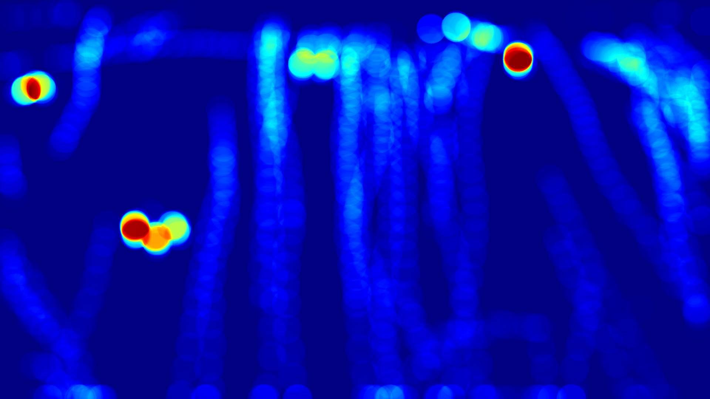

# 🧠 People Flow Detection using Object Tracking & Heatmap Visualization

## 🎯 Objective

Build an automated system that:
- Detects and tracks people in a video
- Draws two horizontal counting lines (IN & OUT) across the frame
- Counts how many people enter (cross the IN line from above) and exit (cross the OUT line from below)
- Shows unique ID and bounding box for each tracked person
- Visualizes the intensity of presence/motion as a heatmap overlay and as a standalone image

---

## ✅ Features

- **People detection:** YOLOv8-based person detection in every frame
- **Object tracking:** DeepSORT/BoTSORT assigns unique IDs to each person and maintains them across frames
- **Counting logic:**  
    - **IN:** Counted when a person crosses the upper (green) line downward  
    - **OUT:** Counted when a person crosses the lower (red) line upward  
- **Live overlay:**  
    - Bounding boxes with IDs, IN/OUT counters, and colored lines on every frame  
    - All annotated frames are saved as a video
- **Heatmap:**  
    - Live heatmap overlay video (motion intensity)  
    - Final static heatmap PNG at the end

---

## 📝 Detection, Tracking & Counting Logic

**Detection:**  
Uses YOLOv8 for robust person detection per frame.

**Tracking:**  
DeepSORT/BoTSORT assigns each detection a unique, persistent ID for the whole video.

**Counting:**  
- Stores previous and current center points for each ID
- **IN:** If a person’s center moves downward across the IN (upper) line and wasn’t counted before, IN increases by 1
- **OUT:** If a person’s center moves upward across the OUT (lower) line and wasn’t counted before, OUT increases by 1

**Lines:**  
- Defined using pixel coordinates, determined by annotating on a frame or via [PolygonZone](https://polygonzone.roboflow.com/)

**Heatmap:**  
- Accumulates detection centers for all tracked people, visualizes as a colored overlay (hotter = more presence/activity)
- Shown live during video and as a static summary at the end

---

## 🧰 Setup

1. **Clone this repository** and install dependencies:
    ```bash
    pip install -r requirements.txt
    ```
2. **Download the YOLOv8 weights** (e.g. `yolov8n.pt`) from [Ultralytics](https://github.com/ultralytics/ultralytics).
3. **Place your video** (e.g. `people-walking.mp4`) in the `data/` directory.

---

## 🚀 Usage

### 1. People Counting & Tracking

```bash
python people_flow.py
```
### 2. Heatmap Generation

```bash
python heatmap.py
```
## 🖼️ Example Results

**Annotated Video:**  
[output/people_count_annotated.mp4](output/people_count_annotated.mp4)

**Heatmap Overlay:**  
[output/people_heatmap_overlay.mp4](output/people_heatmap_overlay.mp4)

**Final Static Heatmap:**  


---

## 📚 Credits

- [Ultralytics YOLO](https://github.com/ultralytics/ultralytics)
- [Supervision](https://github.com/roboflow/supervision)
- [OpenCV](https://opencv.org/)
- [PolygonZone](https://polygonzone.roboflow.com/)

---

## 🔗 Video Source

Original demo video: [People Walking - Roboflow](https://media.roboflow.com/supervision/video-examples/people-walking.mp4)
